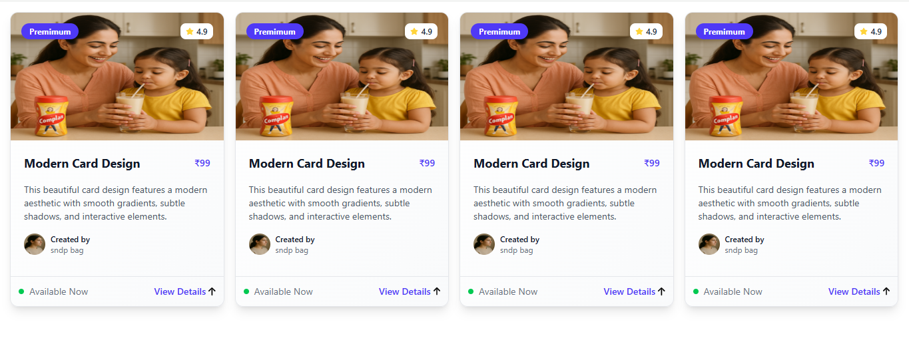

# Responsive Card Layout with Tailwind CSS

This project showcases a responsive grid of modern, elegant product/course cards designed using **Tailwind CSS**. Each card contains an image, category badge, rating, title, price, description, author information, and a call-to-action button.

## 🚀 Features

- 💎 Beautiful, modern card layout
- 📱 Fully responsive (mobile, tablet, desktop)
- 🎨 Styled with Tailwind CSS
- 🌟 Rating display
- 🏷 Category badges (e.g., Premium)
- 👤 Author info with image and label
- 📦 "View Details" button
- 📌 Reusable card component design

## 📸 Screenshot



> ⚠ Replace the screenshot image with a real one in your repo.

## 🛠 Built With

- [Tailwind CSS](https://tailwindcss.com/)
- HTML5

## 📚 How to Use

1. Clone the repo:
   ```bash
   git clone https://github.com/sndpbag/Tailwind-card1.git
   cd card-layout-tailwind


   Open index.html in any browser to view the layout.

Customize the card data and design as needed.

✍️ Author
Sandipan Kr Bag
📧 Email Me
📺 YouTube: sndp bag 4 you

📄 License
This project is licensed under the MIT License.


